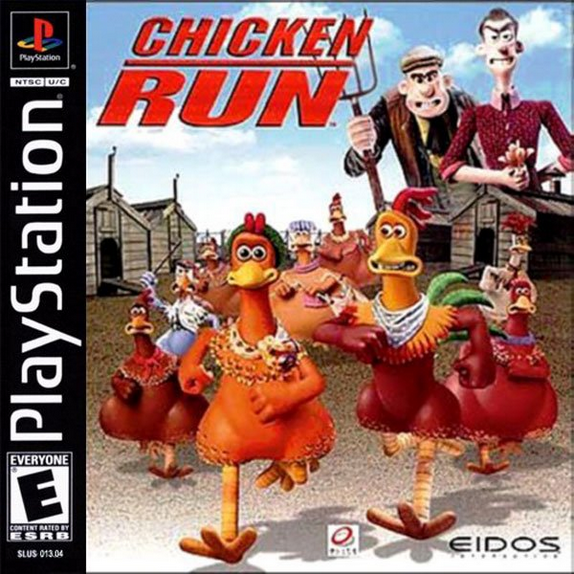

# Chicken Run AR

<p align="center">
  
</p>

<p align="center">
  <strong>An augmented reality chicken-catching game made in Unity.</strong>
</p>

<p align="center">
  
</p>

---

## About

**Chicken Run AR** is a Unity-based augmented reality game where players scan their environment, find flat surfaces, catch chickens and roosters, and return them to the chicken coop.

The game uses AR plane detection and image tracking to place gameplay objects into the real world. Chickens spawn on detected surfaces, move around, and can be tapped by the player. The player collects chickens and roosters, then finds the AR chicken coop marker to deposit them.

---

## Gameplay

The main gameplay loop is:

1. Start the game from the main menu.
2. Move the phone camera around to detect a flat surface.
3. Chickens and roosters spawn in AR.
4. Tap chickens or roosters to catch them.
5. Find the chicken coop marker.
6. Deposit collected chickens into the coop.
7. Try to collect as many as possible before the timer runs out.

---

## Features

* AR plane detection
* AR image tracking for the chicken coop
* Tap-to-catch chicken interaction
* Chicken and rooster spawning
* Chicken movement/wandering behavior
* Score and collection tracking
* Chickens in hand / chickens in coop system
* Roosters in hand / roosters in coop system
* Countdown timer
* Reset progress button
* Sound effects
* Particle effects when catching or depositing chickens
* Main menu and AR gameplay scene

---

## Screenshots / Game Assets

### Logo of BIP Project

<p align="center">
  
</p>

### Game Title

<p align="center">
  
</p>

---

## Project Structure

```text
BIP-Project/
├── Assets/
│   ├── Audio/
│   ├── Materials/
│   │   ├── Logo.png
│   │   └── buttons.png
│   ├── Models/
│   ├── Prefabs/
│   ├── Scenes/
│   │   ├── ARScene.unity
│   │   └── MainMenu.unity
│   ├── Scripts/
│   │   ├── AudioManager.cs
│   │   ├── ChickenBehaviour.cs
│   │   ├── ChickenSpawner.cs
│   │   ├── CountdownTimer.cs
│   │   ├── ImageTrackedChickenCoop.cs
│   │   ├── ImageTrackedCoin.cs
│   │   ├── ImageTrackedCollectibles.cs
│   │   ├── MenuSceneLoader.cs
│   │   ├── PlaceObjectOnPlane.cs
│   │   ├── PlayerStats.cs
│   │   └── UIManager.cs
│   ├── Sprites/
│   │   ├── ChickenPicture.png
│   │   ├── ChickenRun.png
│   │   ├── GDVRAR.png
│   │   ├── magnifying-glass.png
│   │   ├── start.png
│   │   └── —Pngtree—white refresh icon_4543883.png
│   ├── TextMesh Pro/
│   └── XR/
├── Packages/
├── ProjectSettings/
└── README.md
```

---

## Main Scripts

### `ChickenSpawner.cs`

Handles AR chicken spawning. It detects AR planes, spawns chickens or roosters, manages active chickens, handles tap input, and triggers catch effects.

### `ChickenBehaviour.cs`

Controls chicken movement. Chickens wander around their spawn area on the detected AR plane.

### `ImageTrackedChickenCoop.cs`

Handles AR image tracking for the chicken coop. When the coop image marker is detected, the game knows the chicken coop is in sight and can deposit collected chickens.

### `PlayerStats.cs`

Stores player progress, including:

* Chickens in hand
* Chickens in coop
* Roosters in hand
* Roosters in coop

It also saves progress using `PlayerPrefs`.

### `CountdownTimer.cs`

Controls the game timer and updates the timer UI.

### `UIManager.cs`

Updates the UI text for player stats, status messages, and reset functionality.

### `MenuSceneLoader.cs`

Loads the AR gameplay scene from the main menu and handles quitting the game.

---

## Scenes

### `MainMenu`

The starting menu scene. It contains the UI for starting the game.

### `ARScene`

The main gameplay scene. It contains the AR camera, AR session, plane detection, chicken spawning, image tracking, UI, and gameplay logic.

---

## Requirements

Recommended setup:

* Unity `6000.4.11f1` or newer Unity 6 version
* Android device with ARCore support
* Unity Android Build Support
* ARCore-compatible phone
* Camera permission enabled on device

Main Unity packages used by the project include:

* Universal Render Pipeline
* Unity Input System
* Unity UI / UGUI
* TextMeshPro
* XR Management
* ARCore XR Plugin
* AI Navigation

---

## Installation

Clone the repository:

```bash
git clone https://github.com/Zvmcevap/BIP-Project.git
```

Open the project in Unity Hub:

1. Open Unity Hub.
2. Click **Add**.
3. Select the cloned `BIP-Project` folder.
4. Open the project with Unity `6000.4.11f1` or a compatible Unity 6 version.
5. Let Unity import all packages and assets.

---

## Android Build Setup

To build the game for Android:

1. Open **File > Build Profiles** or **File > Build Settings**.
2. Select **Android**.
3. Click **Switch Platform**.
4. Make sure ARCore / XR settings are enabled.
5. Open **Project Settings > XR Plug-in Management**.
6. Enable the ARCore provider for Android.
7. Connect an ARCore-supported Android phone.
8. Click **Build and Run**.

---

## How to Play

1. Launch the app.
2. Press the start button.
3. Move your phone around slowly until AR detects a flat surface.
4. Chickens will spawn on the detected surface.
5. Tap chickens and roosters to catch them.
6. Find the chicken coop AR marker.
7. When the coop is detected, your chickens can be moved into the coop.
8. Use the reset button to clear progress and restart the timer.

---

## Controls

| Action         | Input                                 |
| -------------- | ------------------------------------- |
| Start game     | Tap the start button                  |
| Catch chicken  | Tap a chicken in AR                   |
| Detect coop    | Point camera at the coop image marker |
| Reset progress | Tap the reset button                  |
| Quit game      | Use the quit button from the menu     |

---

## AR Notes

This project uses two main AR systems:

### Plane Detection

Used to find real-world flat surfaces such as tables, floors, or desks. Chickens spawn on these detected planes.

### Image Tracking

Used to detect the chicken coop marker. When the marker is visible, the game treats the chicken coop as being in sight.

For best results:

* Use good lighting.
* Move the phone slowly.
* Avoid reflective surfaces.
* Make sure the marker image is clear and not blurry.
* Keep the marker flat and visible to the camera.

---

## Known Issues / Development Notes

* Some generated Unity folders and build cache folders may be present in the repository and can usually be ignored or cleaned up before release.
* The project currently targets Android ARCore.
* The game should be tested on a real ARCore-supported Android device.
* Editor play mode cannot fully test ARCore behavior without simulation tools or a connected device.

---

## Credits

Developed as a Unity AR project for a chicken-catching augmented reality game.

Built with:

* Unity
* AR Foundation / ARCore
* Universal Render Pipeline
* TextMeshPro
* Unity Input System

---

## License

No license has been specified yet.

Before using or distributing this project publicly, add a license file such as:

* MIT License
* Apache License 2.0
* GPL-3.0
* Creative Commons license for art-only projects

---

## Repository

GitHub repository:

```text
https://github.com/Zvmcevap/BIP-Project
```
